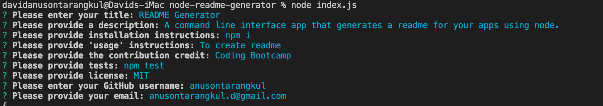

# node-readme-generator

A command line interface app that generates a readme for your apps using node.



|                                         |                                                               |                                                   |
| :-------------------------------------: | :-----------------------------------------------------------: | :-----------------------------------------------: |
| [Introduction](#node-readme-generator)  |            [Table of Contents](#table-of-contents)            | [Development Highlights](#development-highlights) |
|         [Deployment](#deployed)         | [Description of Page Building](#Description-of-Page-Building) |       [Code Hightlights](#code-highlights)        |
| [Technologies Used](#Technologies-Used) |                      [Credits](#Credits)                      |                [License](#License)                |

## Development Highlight

- Use Node.JS file system modules (copyFile, writeFile)
- Use Inquirer.JS from npm
- Object destructuring
- Asynchronous functionality with JavaScript Promise objects

## Deployment

Install dependencies.

```
npm i
```

Run the app.

```
node app.js
```

## Description of Page Building

### Organization

- dist
- src
- utils
- .gitignore
- index.js
- LICENSE
- package-lock.json
- package.json
- README.md
- demo

### Description

- The generated markdown is created in the `dist` folder.
- The function to create the template literal is in the `src` folder.
- The utils has the promise and file system to create the markdown.
- The index.js holds the inquirer prompts and callback function to the utils in order to generate the markdown.

## Code Highlights

Creating a file in node using the file system. A promise is used for asynchronous functionality.

```JavaScript
const writeREADME = contentREADME => {
    return new Promise((resolve, reject) => {
        fs.writeFile('./dist/readme.md', contentREADME, err => {
            if (err) {
                reject(err);
                return;
            }
            resolve({
                ok: true,
                message: 'file created!'
            });
        });
    });
};
```

After the user is prompted with questions, we have a chained asynchronous function to generate the file and catch errors. This style was used to avoid too many callbacks.

```JavaScript
promptUser()
    .then(inquirerData => {
        console.log(inquirerData)
        return generateREADME(inquirerData)
    })
    .then(templateData => {
        console.log(templateData)
        writeREADME(templateData)
    })
    .catch(err => {
        console.log(err)
    })
```

## Technologies Used

### Backend Languages

- [Node.js](https://nodejs.org/en/)

### NPM Dependencies

- [Inquirer.js](https://www.npmjs.com/package/inquirer)

## Credits

|                           |                                                                                                                                                                                                       |
| ------------------------- | ----------------------------------------------------------------------------------------------------------------------------------------------------------------------------------------------------- |
| **David Anusontarangkul** | [ LinkedIn](https://www.linkedin.com/in/anusontarangkul/) [ GitHub](https://github.com/anusontarangkul) |

## License

[](https://opensource.org/licenses/MIT)
